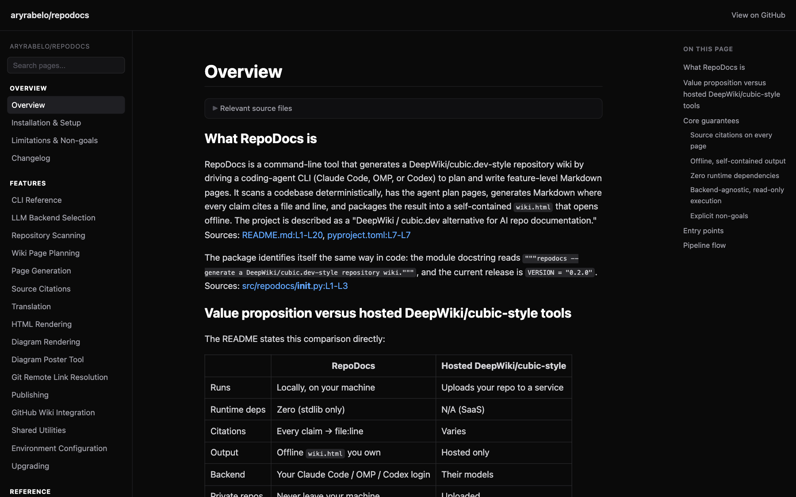
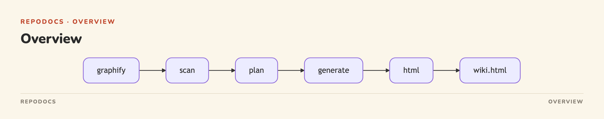

# RepoDocs

**Point RepoDocs at any repo and get a source-cited, always-rebuildable wiki — built by Claude Code, OMP, or Codex.**

[](https://pypi.org/project/repodocs/)
[](https://github.com/aryrabelo/repodocs/actions)
[](LICENSE)


[](https://github.com/aryrabelo/repodocs/wiki)

If RepoDocs is useful to you, please ⭐ the repo — it helps others find it.

RepoDocs is a **DeepWiki / cubic.dev alternative** for AI repo documentation: it
scans a codebase deterministically, drives your coding-agent CLI to plan
feature-level pages, and writes Markdown where **every claim cites a file and
line**. Output is a self-contained `wiki.html` you can open offline. For
maintainers who want docs they can trust — and never hand-write again.

- ✓ Source citations on every page — linked to exact lines
- ✓ Backends: Claude Code (default), OMP, Codex CLI
- ✓ Zero runtime dependencies — Python stdlib only
- ✓ Parallel generation with SHA-256 incremental rebuilds
- ✓ Offline `wiki.html`, optional translation, guarded publishing

## Contents

- [See it in action](#see-it-in-action)
- [Quick start](#quick-start)
- [Setup on a new machine](#setup-on-a-new-machine)
- [Why RepoDocs and not the alternatives](#why-repodocs-and-not-the-alternatives)
- [Choose an LLM backend](#choose-an-llm-backend)
- [Pipeline commands](#pipeline-commands)
- [Publishing safety](#publishing-safety)
- [Upgrading](#upgrading)
- [Non-goals](#non-goals)
- [Development](#development)
- [License](#license)

## See it in action

RepoDocs documents itself — **[browse the wiki it generated for this repo](https://github.com/aryrabelo/repodocs/wiki)**. Every page is written from the source and cites the exact file and lines behind each claim (its Architecture page, for example, links each statement to `src/repodocs/*.py` at a pinned commit), and each diagram is a pre-rendered image so it always renders. That whole wiki came from a single `repodocs-all .` run (see [Quick start](#quick-start)) — nothing hand-written.

## Quick start

**Prerequisites:** Python 3.10+, [uv](https://docs.astral.sh/uv/), and graphify (`uv tool install graphifyy`) — or pass `--no-graph` to skip it. No uv yet?
`curl -LsSf https://astral.sh/uv/install.sh | sh`

Run the full pipeline in any repo — no clone, no install:

```bash
cd /path/to/project
uvx --from repodocs repodocs-all .   # run without installing
```

Open `repo-docs/wiki.html` in a browser. That's it.

### Install persistently

Keep `repodocs` / `repodocs-all` on `PATH`:

```bash
uv tool install repodocs
uv tool update-shell
repodocs --version
```

### Using it from a coding agent

In Claude Code / OMP / Codex, just ask the agent to run `repodocs-all .` and open
the wiki. RepoDocs is a CLI your agent calls — not an in-process plugin.

## Setup on a new machine

Everything runs locally. There are two independent parts: the **core pipeline**
(all you need to generate a wiki) and an **optional diagram tool**. The core has
zero runtime dependencies beyond Python's stdlib; the optional tool adds Bun +
playwright.

### Core pipeline (required)

1. **Python 3.10+** — check with `python3 --version`.
2. **[uv](https://docs.astral.sh/uv/)** — `curl -LsSf https://astral.sh/uv/install.sh | sh`
3. **A backend CLI, logged in** (this is what writes the pages) — pick one:
   - Claude Code (default): install `claude`, run it once and `/login`.
   - OMP: `export REPODOCS_BACKEND=omp`, then `repodocs setup` and `omp --profile=repo-docs` `/login`.
   - Codex: `export REPODOCS_BACKEND=codex`, then `codex login`.

   Details in [Choose an LLM backend](#choose-an-llm-backend).
4. **graphify** — `uv tool install graphifyy` (sharpens planning). Or skip it by
   passing `--no-graph` to `repodocs-all`.
5. **Internet access** — for the backend API, `graphify`, and `git`.

Then, from any repo:
`uvx --from repodocs repodocs-all .`
(or clone this repo and run `uv run repodocs-all /path/to/project`). Output lands
in `repo-docs/wiki.html`.

### Optional: diagram posters (`tools/`)

GitHub's mermaid renderer intermittently fails to load in wikis. To publish a
pre-rendered pastel PNG of a diagram instead, use `tools/diagram_poster.ts`.
This is **not** part of the zero-dependency core — it needs:

1. **[Bun](https://bun.sh/)** — `curl -fsSL https://bun.sh/install | bash`
2. **playwright** — `cd tools && bun install`
3. **A chromium browser** — `bunx playwright install chromium` (downloads
   ~150 MB the first time).

Render: `bun tools/diagram_poster.ts tools/example-overview.yaml --png` writes
`tools/example-overview.png` — the poster shown below. Edit the YAML (a mermaid
block plus an editorial shell) for your own diagram. To put diagrams in a GitHub
wiki, run `repodocs render-diagrams .` — it swaps every mermaid block for a
committed PNG, and `publish-wiki` then ships the images alongside the pages.



## Why RepoDocs and not the alternatives

| | RepoDocs | Hosted DeepWiki/cubic-style |
|---|---|---|
| Runs | Locally, on your machine | Uploads your repo to a service |
| Runtime deps | Zero (stdlib only) | N/A (SaaS) |
| Citations | Every claim → file:line | Varies |
| Output | Offline `wiki.html` you own | Hosted only |
| Backend | Your Claude Code / OMP / Codex login | Their models |
| Private repos | Never leave your machine | Uploaded |

## Choose an LLM backend

Set `REPODOCS_BACKEND` to `claude` (default), `omp`, or `codex`. `REPODOCS_MODEL`
overrides the model. Each backend runs read-only (read/grep/glob only) with no
session persistence.

- **Claude Code (default):** run `claude`, `/login` once; then `repodocs-all .`. Default model `claude-sonnet-5`.
- **OMP:** `export REPODOCS_BACKEND=omp`, `repodocs setup`, `omp --profile=repo-docs`, `/login` once.
- **Codex CLI:** `export REPODOCS_BACKEND=codex`, `codex login`. Ephemeral read-only sandbox.

## Pipeline commands

```bash
repodocs-all .                 # full pipeline: graphify → scan → plan → generate → html
repodocs scan .                # deterministic inventory
repodocs plan .                # write repo-docs/plan.json
repodocs generate .            # generate changed Markdown pages
repodocs translate . --lang pt # optional translation
repodocs html . --vendor       # build offline wiki.html
repodocs publish . --dry-run   # review the public payload (always first)
```

`repodocs <command> --help` lists every flag. `REPODOCS_JOBS` (1–16, default 4)
controls parallelism; `REPODOCS_TIMEOUT` sets each LLM subprocess timeout. A bare
invocation prints help, not a stack trace.

## Publishing safety

Publishing stages files in a temporary worktree, **refuses `main`/`master`/`trunk`**,
scans output for private-key/token patterns, and requires `--allow-public`. Always
`--dry-run` first. Generated docs can still reveal sensitive source detail that
matches no token pattern — **review the dry-run file list before publishing a
private repo's wiki.** GitHub Wiki export (`publish-wiki`) is also supported.

### First-time GitHub Wiki setup

`publish-wiki` pushes to your repo's wiki (`github.com/<owner>/<repo>.wiki.git`), but GitHub only creates that wiki repo **after its first page exists**. Once, in the GitHub UI: **Settings → Features → enable Wikis**, then open the **Wiki** tab and **create the first page** (a `Home` page with any content — `publish-wiki` overwrites it). After that, `repodocs publish-wiki . --dry-run` then `--allow-public` works, and re-runs update the pages in place.

## Upgrading

```bash
uv tool upgrade repodocs                                   # if installed as a tool
# or force the latest:
uv tool install --force repodocs
```

## Non-goals

RepoDocs does not host generated wikis, replace source-code review, guarantee
output is safe to publish without human review, or manage credentials for the
agent CLIs.

## Development

Run the checks with `uv run --extra test pytest -q`. Contributions:
[CONTRIBUTING.md](CONTRIBUTING.md) · Security: [SECURITY.md](SECURITY.md).

## License

[MIT](LICENSE) © Ary Rabelo
